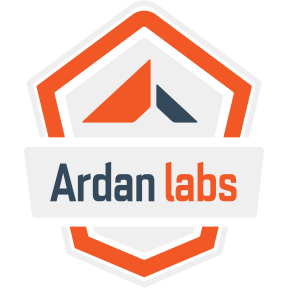

# Rust/AI Workshop



> **Work in progress.** This is the live-teaching material for the Ardan Labs
> Rust/AI workshop. The `code/` examples are further along than the `manual/`
> prose; chapters that are still being written are marked *(placeholder)* below.
> Feedback very welcome.

## Repository Layout

```text
code/
  Cargo.toml            # workspace; every exNN crate is a member
  ex01_hello/ ... ex15_provenance/
    Cargo.toml
    src/main.rs         # some also have src/chatbot.rs
    .env                # local only, gitignored (contains OPENROUTER_KEY)
manual/
  book.toml
  src/                  # the book source
  theme/                # Ardan Labs styling
  book/                 # generated by `mdbook build`, gitignored
```

## Getting the Code

```bash
git clone https://github.com/thebracket/ardan_ai_class1.git
cd ardan_ai_class1
```

## Viewing the Manual

```bash
cargo install mdbook
cd manual
mdbook serve --open
```

The manual is served at <http://localhost:3000>. To build a static copy
instead (written to `manual/book/`, which is gitignored):

```bash
mdbook build manual
```

## Examples

| Example | Chapter | What it shows |
| ------- | ------- | ------------- |
| [`ex01_hello`](code/ex01_hello) | [Getting Started](manual/src/01_start/intro.md) | An async "hello world" with Tokio — a toolchain sanity check |
| [`ex02_simple_request`](code/ex02_simple_request) | [A Simple Request](manual/src/02_llm_call/simple_request_1.md) | One non-streaming request, and reading the reply |
| [`ex03_streaming`](code/ex03_streaming) | [Streaming Requests](manual/src/02_llm_call/streaming_1.md) | Streaming the raw bytes back from the API |
| [`ex04_streaming`](code/ex04_streaming) | [Reqwest Streams](manual/src/02_llm_call/streaming_2.md) | Parsing server-sent events (SSE) by hand |
| [`ex05_streaming`](code/ex05_streaming) | [Interactivity with Channels](manual/src/02_llm_call/streaming_4.md) | Typed message structs and an `mpsc` channel |
| [`ex06_refactor`](code/ex06_refactor) | [A Quick Refactor](manual/src/02_llm_call/multi_2.md) | Pulling the chat logic into a `ChatSession` (`chatbot.rs`) |
| [`ex07_multi_turn`](code/ex07_multi_turn) | [Adding State](manual/src/02_llm_call/multi_3.md) | A growing `ChatTurn` history — and why it matters |
| [`ex08_tools`](code/ex08_tools) | [Hard-Coded Tool](manual/src/02_llm_call/tools_2.md) | A hard-coded `get_time` tool and the tool-call loop |
| [`ex09_tools_generic`](code/ex09_tools_generic) | [Generic Tool Calls](manual/src/02_llm_call/tools_3.md) | A `ToolFactory` trait and reusable `ToolDefinition` |
| [`ex10_tools_params`](code/ex10_tools_params) | [Tool Calls with Parameters](manual/src/02_llm_call/tools_4.md) | A parameterised tool (`roll_dice` with a `sides` argument) |
| [`ex11_bash_tool`](code/ex11_bash_tool) | [DANGER Will Robinson](manual/src/02_llm_call/tools_5.md) | The deliberately unsafe `bash` tool, confined to a container |
| [`ex12_docker_safety`](code/ex12_docker_safety) | [Containers - Docker](manual/src/02_llm_call/tools_docker.md) | A non-root container refusing a file read, and the error reaching the model |
| [`ex13_bwrap_sandbox`](code/ex13_bwrap_sandbox) | [Sandboxes - Bubblewrap](manual/src/02_llm_call/tools_bwrap.md) | The `bash` tool wrapped in a Bubblewrap sandbox, with a Docker fallback for non-Linux hosts |
| [`ex14_injection`](code/ex14_injection) | [Prompt Injection Example](manual/src/02_llm_call/prompt_injection_2.md) | A harmless weather tool that smuggles a pirate instruction into the conversation |
| [`ex15_provenance`](code/ex15_provenance) | [Provenance](manual/src/02_llm_call/provenance.md) | Explicit and enforced provenance: refusing privileged tools after untrusted data |

## Contents

The full table of contents is [`manual/src/SUMMARY.md`](manual/src/SUMMARY.md).

- Introduction (placeholder)
  - Who Am I? (placeholder)
  - Format (placeholder)
  - Signposting (placeholder)
- [Getting Started](manual/src/01_start/intro.md)
- [Talking to AI Models](manual/src/02_llm_call/intro.md)
  - [A Simple Request](manual/src/02_llm_call/simple_request_1.md)
    - [Making the Call](manual/src/02_llm_call/simple_request_2.md)
    - [Using The Requestor](manual/src/02_llm_call/simple_request_3.md)
    - [Understanding the Response](manual/src/02_llm_call/simple_request_4.md)
  - [Streaming Requests](manual/src/02_llm_call/streaming_1.md)
    - [Reqwest Streams](manual/src/02_llm_call/streaming_2.md)
    - [Fetching the Response](manual/src/02_llm_call/streaming_3.md)
    - [Interactivity with Channels](manual/src/02_llm_call/streaming_4.md)
  - [Multi-Turn Chats](manual/src/02_llm_call/multi_1.md)
    - [A Quick Refactor](manual/src/02_llm_call/multi_2.md)
    - [Adding State](manual/src/02_llm_call/multi_3.md)
    - [Warning: Unbounded Growth](manual/src/02_llm_call/multi_4.md)
  - [Tool Use](manual/src/02_llm_call/tools_1.md)
    - [Hard-Coded Tool](manual/src/02_llm_call/tools_2.md)
    - [Generic Tool Calls](manual/src/02_llm_call/tools_3.md)
    - [Tool Calls with Parameters](manual/src/02_llm_call/tools_4.md)
    - [Structured Output from Tools](manual/src/02_llm_call/tools_structured.md)
    - [DANGER Will Robinson](manual/src/02_llm_call/tools_5.md)
      - [Safety Options for Tools](manual/src/02_llm_call/tools_6.md)
        - [Containers - Docker](manual/src/02_llm_call/tools_docker.md)
        - [Sandboxes - Bubblewrap](manual/src/02_llm_call/tools_bwrap.md)
      - Governance (placeholder)
  - MCP Server Use (placeholder)
  - Structured AI Call Output (placeholder)
  - [Prompt Injection](manual/src/02_llm_call/prompt_injection.md)
    - [Prompt Injection Example](manual/src/02_llm_call/prompt_injection_2.md)
    - [Provenance](manual/src/02_llm_call/provenance.md)
      - [Explicit Provenance](manual/src/02_llm_call/provenance_explicit.md)
      - [Enforced Provenance](manual/src/02_llm_call/provenance_enforced.md)
      - [What Provenance Buys You](manual/src/02_llm_call/provenance_takeaways.md)
  - Make a Library (placeholder)
  - Wrap Up (placeholder)
- Writing MCP Servers (placeholder)
- Retrieval Augmented Generation (RAG) (placeholder)
- Agents (placeholder)
  - The Agentic Loop (placeholder)
  - A Very Simple Agent (placeholder)
  - Be Deterministic When Possible (placeholder)
  - Lots more (placeholder)
- Production Concerns (placeholder)
  - Concurrency (placeholder)
  - Retries (placeholder)
  - Observability (placeholder)
  - Testing (placeholder)
- Governance in the Real World (placeholder)
- Wrap Up (placeholder)
