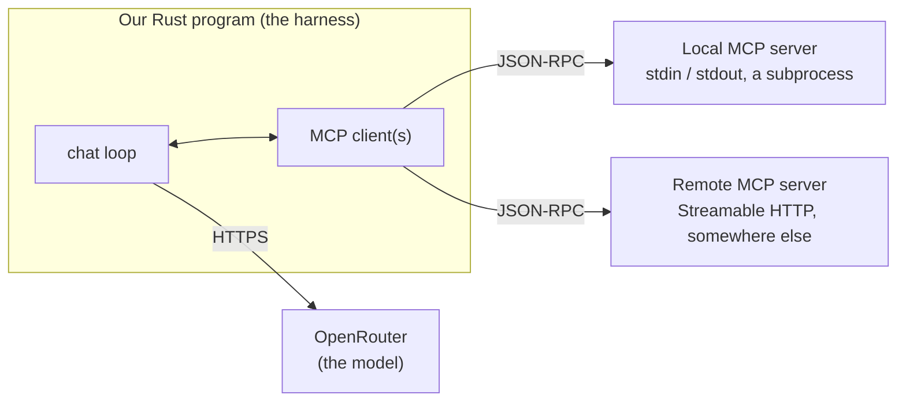

# What is MCP, and Why Would I Use It?

You've probably heard of the magic of MCP (Model Context Protocol) servers. Add Gmail, Linear, your bank account,
and everything else into ChatGPT - and it magically knows that you need to remember to send your mother $10, or
that you need to fix something.

MCP servers are interesting. Just like tool calls, they don't run on the server providing the model (in our
case OpenRouter). Your harness is responsible for running (or connecting to) MCP servers, and for providing the
model with the options they make available. Just like tool calls, your harness is also responsible for actually
executing the call.

MCP servers can be:

* *Local* - your harness launches the server as a subprocess, and talks to it over `stdin` (requests) and
  `stdout` (responses). Anything the server wants to log goes to `stderr`, so it can't corrupt the conversation.
* *Remote* - you connect to an MCP server somewhere else, just like any other API, using the *Streamable HTTP*
  transport.

In both cases the *protocol* is identical: you send and receive `JSON-RPC` messages, and relay the results to the
model. This is worth internalising early, because it's the bit that trips people up. There is one protocol with
two ways of carrying it. The messages don't change; only the plumbing does.

The model never speaks MCP. It sees tools exactly like the ones we hand-wrote in `ex08`-`ex10`; our harness is
what turns an MCP server's tool list into the `tools` array we already send, and what routes a `tool_call` back
out to the right server. That's the same loop we've been building all along - MCP just standardises where the tool
definitions come from.

## Benefits of MCP

Online services can offer MCP servers to let agents interact with them on your behalf. This ranges from
web-browsers offering a server for debugging to a bank allowing agents to help manage your account. In
enterprises, MCP servers often provide a way for internal services to make themselves available to internal
agentic processes.

For us, writing our own tools, the win is less about magic and more about interop: a tool written once can be used
by our harness, by Claude Desktop, by an IDE, or by whatever comes next. We don't have to teach every new agent
about our particular API.

## Downsides of MCP

MCP is more complicated than a simple tool-call. Many people have commented that you don't need MCP, you just need
an API and to give your agent API-calling capabilities. That can be true, especially with older versions of the MCP
protocol that featured authentication systems that could be quite unpleasant to work with!

There is a security angle too: a remote MCP server is somebody else's code, and it hands us the very tool
descriptions that we feed straight to the model. We'll come back to that in detail - just file it away for now.

Next, we'll look at the two transports a little more closely, and at where an MCP server actually lives.
