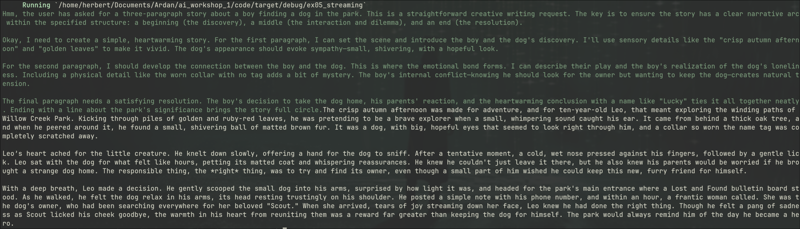

# Interactivity with Channels

> We're in `ex05_streaming` in the repo.

Let's do a little bit of cleaning up. I really don't like chains of `if let`, and in deserializing it's pretty slow (as Rust goes). So instead, we can define some types to
wrap the bits of JSON we're interested in:

```rust
use serde::Deserialize;

#[derive(Deserialize, Debug)]
struct ChoiceResponses {
    choices: Vec<Delta>,
}

#[derive(Deserialize, Debug)]
struct Delta {
    delta: Message,
}

#[derive(Deserialize, Debug)]
struct Message {
    reasoning: Option<String>,
    content: Option<String>,
}
```

> Tip! If you're using Rust Rover, it has a feature for generating structs from JSON examples. VSCode has similar plugins available.

That lets us simplify the decoding quite a bit:

```rust
 while let Some(Ok(event)) = response.next().await {
        if event.event_type == "message" {
            let Ok(choice) = serde_json::from_str::<ChoiceResponses>(&event.data) else {
                break;
            };
            for delta in choice.choices {
            // Continues!
```

Now, let's consider *streaming* responses out of the LLM call function. We'll start with a type defining the types of LLM response we're interested in:

```rust
enum ModelReply {
    Reasoning(String),
    Content(String),
}
```

Now, we'll change the function signature:

```rust
async fn send_prompt(
    api_key: String,
    model: String,
    prompt: String,
    reply: Sender<ModelReply>,
) -> anyhow::Result<()> {
```

Stop returning a string, and just an empty result (so we can still handle errors). `Sender is a `tokio::sync::mpsc::Sender` - a channel sender. We can then use this to stream responses back as we receive them:

```rust
  while let Some(Ok(event)) = response.next().await {
        if event.event_type == "message" {
            let Ok(choice) = serde_json::from_str::<ChoiceResponses>(&event.data) else {
                break;
            };
            for delta in choice.choices {
                if let Some(reasoning) = delta.delta.reasoning {
                    reply.send(ModelReply::Reasoning(reasoning)).await?;
                } else if let Some(content) = delta.delta.content {
                    reply.send(ModelReply::Content(content)).await?;
                }
            }
        }
    }
```

We need to `cargo add colored`. And then our `main()` function becomes:

```rust
#[tokio::main]
async fn main() -> anyhow::Result<()> {
    // Make sure you have OPENROUTER_KEY as an environment variable or in .env
    let _ = dotenvy::dotenv()?;
    let api_key = std::env::var("OPENROUTER_KEY")?;

    // Make the stream
    let (tx, mut rx) = tokio::sync::mpsc::channel(32);

    tokio::spawn(async move {
        use colored::Colorize;
        while let Some(message) = rx.recv().await {
            match message {
                ModelReply::Reasoning(text) => print!("{}", &text.green()),
                ModelReply::Content(text) => print!("{}", &text.white()),
            }
        }
    });

    // Prompt the model
    send_prompt(
        api_key,
        "deepseek/deepseek-v4.1-flash".to_string(),
        "Please write a 3 paragraph story about a boy who finds a dog in the park".to_string(),
        tx,
    )
    .await?;

    println!();
    Ok(())
}
```

We spawn a task to receive channel events, and print them (in color!) as they arrive.


